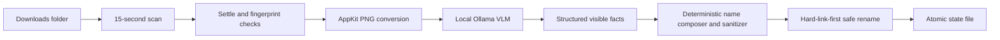

<p align="center">
  
</p>

<h1 align="center">Image Autonamer</h1>

<p align="center">
  <strong>Useful filenames. Local vision. Zero cloud uploads.</strong>
</p>

<p align="center">
  A sandboxed macOS menu bar app that watches Downloads, understands new images with a local vision-language model, and safely renames them.
</p>

<p align="center">
  <a href="https://github.com/DavidVaness/image-autonamer/releases/latest"></a>
  
  
  
  <a href="LICENSE"></a>
</p>

<p align="center">
  
</p>

<p align="center">
  <a href="docs/assets/demo.mp4"><strong>Watch the 60-second demo in HD</strong></a>
  ·
  <a href="https://github.com/DavidVaness/image-autonamer/releases/latest"><strong>Download v0.4.0</strong></a>
</p>

## Install in one command

On an Apple Silicon Mac running macOS 13 or newer:

```sh
curl -fsSL https://raw.githubusercontent.com/DavidVaness/image-autonamer/main/scripts/install.sh | sh
```

The installer downloads the checksum-verified app, installs Ollama through Homebrew if needed, pulls `qwen3-vl:4b`, and opens Image Autonamer.
If you prefer to inspect code before running it, clone the repository and use `./scripts/install-macos-app.sh`.

On first launch, the Settings window opens automatically.
Click **Grant Access**, choose Downloads, and click **Allow Downloads**.
That one explicit choice creates a persistent security-scoped bookmark inside the app sandbox.
Full Disk Access is not required.

> [!NOTE]
> The v0.4.0 binary is ad-hoc signed and supports Apple Silicon.
> A Developer ID certificate and Apple notarization are the remaining steps for conventional consumer distribution.
> Intel Macs can build from source.

## See it work

This sample is original vector artwork created for this repository and released under the same MIT license as the code.
It is safe to reuse in articles, screenshots, and demos.

<p align="center">
  
</p>

The checked-in sample was passed through the real local model during release validation:

```text
sample-landscape.png  ->  mountains-sunset-lake-trees.png
```

Model wording can vary slightly between Ollama and model versions.
Representative everyday results look like this:

| Before | After | Useful signal captured |
| --- | --- | --- |
| `Screenshot 2026-08-11.png` | `purple-sales-dashboard-bar-chart.png` | Interface, color, and primary chart |
| `IMG_8472.JPG` | `red-coffee-mug-beside-laptop.jpg` | Main objects and their relationship |
| `download.webp` | `orange-cat-sleeping-on-sofa.webp` | Subject, action, and setting |

The original extension is normalized and preserved.
If a filename already exists, Image Autonamer adds `-2`, `-3`, and so on without overwriting anything.

## Naming modes

Open Image Autonamer from Finder, Spotlight, or your app switcher to show Settings, then choose the **Naming** tab.
You can also select **Configure…** from the Naming status row in the menu bar app.
The preview button analyzes a selected image locally and shows the proposed filename without renaming or moving the file.

| Mode | Example result | Best for |
| --- | --- | --- |
| Descriptive | `red-coffee-mug-beside-laptop.jpg` | General screenshots, photos, and downloaded images |
| Date + descriptive | `2026-08-11-red-coffee-mug-beside-laptop.jpg` | Chronological sorting and camera imports |
| Documents | `2026-08-01-example-co-invoice-inv-1042-annual-renewal.png` | Scans and screenshots of invoices, receipts, statements, contracts, letters, reports, certificates, and tax documents |

Date-prefixed names use the image capture date when metadata provides one, then fall back to the file creation or modification date.
Documents mode infers the correspondent from the visible issuer, sender, merchant, or wordmark in each file.
It classifies the document type and then applies a deterministic type-specific recipe.
Invoices can include a visible invoice reference, statements prefer a visible statement period, and receipts omit reference numbers to stay concise.
Missing or ambiguous metadata is omitted instead of guessed.
An optional Naming context field accepts up to 500 characters of workflow guidance, such as the type of business or image collection.
The app normalizes that text and instructs the local model to treat it as reference data without overriding visible-evidence rules.
There is intentionally no unrestricted system-prompt editor.

## Measured locally

The repository includes eight original, MIT-licensed evaluation images across illustrations, screenshots, objects, documents, diagrams, interfaces, and indoor and outdoor scenes.
The harness records the proposed filename, concept coverage, forbidden-concept hits, and latency for every image without renaming the fixtures.

The checked-in `qwen3-vl:4b` baseline produced useful filenames for all 8 fixtures with a warm-model median local inference time of approximately 0.8 seconds on the release machine.
Cold-model latency was higher and varies substantially with hardware and Ollama state.
This is a small transparent baseline, not a claim of general model accuracy.

```sh
./scripts/build-eval-fixtures.sh
./eval/run.py --model qwen3-vl:4b --output eval/results/qwen3-vl-4b.json
```

See [`eval/manifest.json`](eval/manifest.json) for the explicit rubric and [`eval/results/qwen3-vl-4b.json`](eval/results/qwen3-vl-4b.json) for the complete result.

## Why this exists

Downloads folders quickly fill with UUIDs, camera counters, and names such as `image (12).png`.
Cloud vision APIs can fix that, but uploading private screenshots and photos solely to rename them is an uncomfortable trade.
Image Autonamer keeps inference on the Mac and limits automatic filesystem access to the Downloads folder the user explicitly selects.

## What it does

- Runs image understanding locally through [Ollama](https://ollama.com/) and `qwen3-vl:4b`.
- Watches new top-level images in Downloads every 15 seconds.
- Starts automatically through the native macOS login-item API.
- Uses the App Sandbox with only user-selected read/write and outbound client entitlements.
- Shows whether Downloads access is granted and keeps recovery one click away.
- Protects images that existed before first-run setup.
- Waits for downloads to settle and verifies that a file did not change during analysis.
- Treats model output as untrusted input and reduces it to a safe lowercase ASCII slug.
- Offers three focused naming modes, dynamic document recipes, and a no-rename preview instead of an open-ended prompt surface.
- Uses collision-safe filesystem operations that never overwrite another file.
- Includes a standalone Python CLI for dry runs, one-off images, recursive batches, and Linux.

The native app recognizes AVIF, BMP, GIF, HEIC, HEIF, JPEG, PNG, TIFF, and WebP by extension.
AppKit converts each image to PNG before inference, which gives Ollama a consistent input format.

## How it works



`ImageProcessor` is a Swift actor, so scans cannot mutate state concurrently.
Ollama is asked for schema-constrained visible facts at a low temperature.
Deterministic code applies the selected naming mode, and the result is still sanitized before touching the filesystem.
The source is fingerprinted before and after inference to catch partial or changing downloads.

## Security model

The app accepts only the current user's actual Downloads folder in its picker.
macOS supplies a security-scoped capability for that folder, and the app persists the capability as a bookmark in its private container.
It has no Full Disk Access, no automation entitlement, no telemetry, and no third-party API.

Image bytes are sent to the configured Ollama endpoint, which is hard-coded by default to `http://127.0.0.1:11434`.
The sandbox entitlement technically permits outbound client connections because macOS does not offer a localhost-only network entitlement.
The shipped code uses no remote endpoint.
Optional naming context is included only in requests to that same local endpoint and is stored in the app's private preferences.

Filesystem handling is defensive:

- Unsupported files, hidden files, subfolders, and symbolic links are ignored.
- Existing images are baselined during setup instead of unexpectedly renamed.
- A second fingerprint check rejects files modified during model inference.
- A hard-link-first operation claims the destination atomically before removing the source name.
- Destination collisions select a numbered suffix instead of overwriting.
- Processing state is written atomically inside the sandbox container.

## Engineering decisions

| Decision | Alternative considered | Why this design won |
| --- | --- | --- |
| Sandboxed native menu app | Python daemon or `launchd` job | Folder authorization is explicit, persistent, and scoped to one folder instead of inheriting broad terminal or interpreter permissions. |
| 15-second polling | FSEvents | A small top-level directory scan is predictable, easy to test, and naturally pairs with the settle window for partially downloaded files. |
| Local Ollama inference | Hosted vision API | Privacy and offline operation matter more here than model startup time and disk usage. |
| JSON schema plus sanitizer | Free-form model text | Model output remains untrusted even when structured generation succeeds. |
| Three modes plus deterministic composition | Raw custom prompts | Common workflows stay predictable, testable, and resistant to prompt mistakes while the tool remains focused. |
| Bounded reference context | An unrestricted system-prompt editor | Users can add domain vocabulary without weakening visible-evidence rules or turning the app into a prompt workbench. |
| Dynamic visible correspondents | A manually maintained company list | Each document can name its actual issuer while the visible-evidence gate prevents unsupported brand guesses. |
| Type-specific document recipes | One generic business filename | Invoices, receipts, statements, and other documents include only metadata that is useful for that type. |
| Hard link, then unlink | `moveItem` after an existence check | Claiming the destination atomically removes the check-then-write race that could overwrite a file. |
| Ad-hoc signed release artifact | Unsigned bundle or premature App Store packaging | The artifact is reproducible and sandboxed today, while notarization remains an explicit production-distribution follow-up. |

## Manual CLI

The Python 3.11+ CLI is useful for dry runs, individual files, recursive directories, or non-macOS systems.
It is not sandboxed, so the native app is the safer choice for continuous macOS automation.

Preview without changing files:

```sh
./bin/image-autonamer --dry-run ~/Downloads
```

Rename one image:

```sh
./bin/image-autonamer ~/Downloads/IMG_8472.PNG
```

Process a directory tree:

```sh
./bin/image-autonamer --recursive /path/to/images
```

Run `./bin/image-autonamer --help` for the complete command reference.

## Build and test

Requirements for source builds are macOS 13+, Swift 6, Xcode Command Line Tools, Python 3.11+, and Ollama.

```sh
# Native unit tests
swift test

# Python unit and contract tests
PYTHONPATH=src python3 -m unittest discover -s tests -v

# Release app and checksum manifest
./scripts/package-release.sh 0.4.0

# Rebuild the 60-second MP4 and GIF from original SVG sources
./scripts/build-demo.sh

# Rebuild the native icon and GitHub social preview
./scripts/build-brand-assets.py
```

Native tests cover sanitization, first-run protection, safe renaming, and collision handling.
Python tests additionally cover the CLI, state database, file settling, discovery, and Ollama request/response contract.
CI intentionally mocks Ollama because downloading a multi-gigabyte model on every run would make the suite slow and wasteful.

Project landmarks:

```text
Sources/ImageAutonamerKit/   Local inference and safe processing actor
Sources/ImageAutonamerMac/   Menu bar lifecycle, bookmark, and login item
src/image_autonamer/         Portable Python CLI
tests/                       Swift and Python test suites
scripts/                     Build, install, package, and demo tooling
docs/                        Original demo sources and generated media
```

See [CONTRIBUTING.md](CONTRIBUTING.md) for contribution guidelines.
See [ROADMAP.md](ROADMAP.md) for the deliberately narrow product direction and [SECURITY.md](SECURITY.md) for private vulnerability reporting.

## Troubleshooting

### Ollama is unavailable

Open Ollama and verify the local endpoint:

```sh
curl http://127.0.0.1:11434/api/tags
ollama pull qwen3-vl:4b
```

### Folder access was cancelled

Open Image Autonamer and choose **Grant Access** or **Reauthorize…** in General Settings.
Select Downloads and click **Allow Downloads**.
There is no `+` button to find in System Settings.

### The menu bar icon is hidden

macOS may place extra status items behind Control Center when menu bar space is limited.
Open Image Autonamer from Finder, Spotlight, or your app switcher to use the full Settings window without the menu bar icon.

### The build uses the wrong Swift toolchain

Point the installer at a specific Swift binary:

```sh
SWIFT_BIN=/path/to/swift ./scripts/install-macos-app.sh
```

## Uninstall

Open the menu bar icon, turn off **Launch at Login**, and quit the app.
Move `~/Applications/Image Autonamer.app` to Trash.

The sandbox container remains at `~/Library/Containers/com.davidvaness.image-autonamer` so reinstalling preserves folder authorization and processing state.
Remove that container manually if you also want to erase the saved state and bookmark.

## License

Image Autonamer, its logo, and the original demo artwork are available under the [MIT License](LICENSE).
